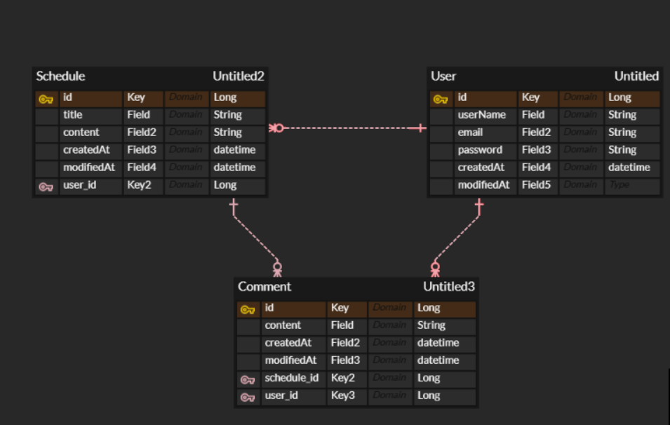

# 스파르타 스프링 일정 관리(Develop) 과제

# ERD


# API 명세서
- Base URL : `http://localhost:8080`
---
## Schedule API 명세서

<details>

<summary> 생성</summary>

### 생성(C)
- URL : `/schedules`
- Method : `POST`
#### Request Body(JSON)

```
{    

"title" : "일정 제목",    

"content" : "일정 내용"

}
```

| 이름 | 데이터타입 | 설명 |
| --- | --- | --- |
| title | String | 일정 제목 |
| content | String | 일정 내용 |

#### Response Body(JSON)

- 성공 응답 : 201 Created

```
{    

"id" : number,    

"title" : "일정 제목",    

"content" : "일정 내용",    

"userName" : "유저명",    

"createdAt" : "작성 일자",    

"modifiedAt" : "수정 일자"

}
```

| 이름 | 데이터타입 | 설명 |
| --- | --- | --- |
| id | Long | schedule 고유 ID |
| title | String | 일정 제목 |
| content | String | 일정 내용 |
| userName | String | 유저명 |
| createdAt | LocalDateTime | 작성 일자 |
| modifiedAt | LocalDateTime | 수정 일자 |
- XXX 에러 응답 : 400 Bad Request

```
{
"message" : "각 validation 예외 조건에 해당하는 메시지"
}
```

| 이름 | 데이터타입 | 설명 |
| --- | --- | --- |
| message | String | 각 validation 예외 조건에 해당하는 메시지 |
- XXX 에러 응답 : 401 Unauthorized

```
{
"message" : "로그인이 필요한 기능입니다."
}
```

| 이름 | 데이터타입 | 설명 |
| --- | --- | --- |
| message | String | 로그인이 되어 있지 않을 시에 예외 처리 |

- XXX 에러 응답 : 404 Not Found

```
{
"message" : "존재하지 않는 유저입니다."
}
```

| 이름 | 데이터타입 | 설명 |
| --- | --- | --- |
| message | String | 유저가 존재하지 않을 시에 예외 처리 |
- XXX 에러 응답 : 500 Internal Server Error

```
none
```

| 이름 | 데이터타입 | 설명 |
| --- | --- | --- |
|  |  |  |

</details>

<details>
<summary> 조회 </summary>

### 전체조회(R)

- 파라미터 존재 시 URL : `/schedules?userName = 유저명`
- 파라미터 존재 X 시 URL : `/schedules`
- Method : `GET`

#### Request Body(JSON)

```
none
```

| 이름 | 데이터타입 | 설명 |
| --- | --- | --- |
|  |  |  |

#### Response Body(JSON)

- 성공 응답 : 200 OK

```
[    

{        

"id" : number1,        

"title" : "일정 제목1",        

"content" : "일정 내용1",        

"userName" : "유저명1",        

"createdAt" : "작성 일자1",        

"modifiedAt" : "수정 일자1"    

},        

{        

"id" : number2,        

"title" : "일정 제목2",        

"content" : "일정 내용2",        

"userName" : "유저명2",        

"createdAt" : "작성 일자2",        

"modifiedAt" : "수정 일자2"    

}

]
```

| 이름 | 데이터타입 | 설명 |
| --- | --- | --- |
| id | Long | schedule 고유 ID |
| title | String | 일정 제목 |
| content | String | 일정 내용 |
| userName | String | 유저명 |
| createdAt | LocalDateTime | 작성 일자 |
| modifiedAt | LocalDateTime | 수정 일자 |
- XXX 에러 응답 : 401 Unauthorized

```
{
"message" : "로그인이 필요한 기능입니다."
}
```

| 이름 | 데이터타입 | 설명 |
| --- | --- | --- |
| message | String | 로그인이 되어 있지 않을 시에 예외 처리 |
- XXX 에러 응답 : 500 Internal Server Error

```
none
```

| 이름 | 데이터타입 | 설명 |
| --- | --- | --- |
|  |  |  |

---

### 선택 조회(R)

- URL : `/schedules/{scheduleId}`
- Method : `GET`

#### Request Body(JSON)

```
none
```

| 이름 | 데이터타입 | 설명 |
| --- | --- | --- |
|  |  |  |

#### Response Body(JSON)

- 성공 응답 : 200 OK

```
{    

"id" : number,    

"title" : "일정 제목",    

"content" : "일정 내용",    

"userName" : "유저명",    

"createdAt" : "작성 일자",    

"modifiedAt" : "수정 일자"

}
```

| 이름 | 데이터타입 | 설명 |
| --- | --- | --- |
| id | Long | schedule 고유 ID |
| title | String | 일정 제목 |
| content | String | 일정 내용 |
| userName | String | 유저명 |
| createdAt | LocalDateTime | 작성 일자 |
| modifiedAt | LocalDateTime | 수정 일자 |
- XXX 에러 응답 : 401 Unauthorized

```
{
"message" : "로그인이 필요한 기능입니다."
}
```

| 이름 | 데이터타입 | 설명 |
| --- | --- | --- |
| message | String | 로그인이 되어 있지 않을 시에 예외 처리 |
- XXX 에러 응답 : 404 Not Found

```
{
"message" : "존재하지 않는 일정입니다."
}
```

| 이름 | 데이터타입 | 설명 |
| --- | --- | --- |
| message | String | 일정이 존재하지 않을 시에 예외 처리 |
- XXX 에러 응답 : 500 Internal Server Error

```
none
```

| 이름 | 데이터타입 | 설명 |
| --- | --- | --- |
|  |  |  |

</details>

<details>
<summary> 수정 </summary>

### 수정(U)

- URL : `/schedules/{scheduleId}`
- Method : `PUT`

#### Request Body(JSON)

```
{    

"title" : "수정 일정 제목"

}
```

| 이름 | 데이터타입 | 설명 |
| --- | --- | --- |
| title | String | 수정 일정 제목 |

#### Response Body(JSON)

- 성공 응답 : 200 OK

```
{    

"id" : number,    

"title" : "수정 일정 제목",    

"content" : "일정 내용",    

"userName" : "유저명",    

"createdAt" : "작성 일자",    

"modifiedAt" : "수정 일자"

}
```

| 이름 | 데이터타입 | 설명 |
| --- | --- | --- |
| id | Long | schedule 고유 ID |
| title | String | 수정 일정 제목 |
| content | String | 일정 내용 |
| userName | String | 유저명 |
| createdAt | LocalDateTime | 작성 일자 |
| modifiedAt | LocalDateTime | 수정 일자 |
- XXX 에러 응답 : 400 Bad Request

```
{
"message" : "각 validation 예외 조건에 해당하는 메시지"
}
```

| 이름 | 데이터타입 | 설명 |
| --- | --- | --- |
| message | String | 각 validation 예외 조건에 해당하는 메시지 |
- XXX 에러 응답 : 401 Unauthorized

```
{
"message" : "로그인이 필요한 기능입니다."
}
```

| 이름 | 데이터타입 | 설명 |
| --- | --- | --- |
| message | String | 로그인이 되어 있지 않을 시에 예외 처리 |
- XXX 에러 응답 : 403 Forbidden

```
{
"message" : "본인이 작성한 항목만 수정 또는 삭제할 수 있습니다."
}
```

| 이름 | 데이터타입 | 설명 |
| --- | --- | --- |
| message | String | 본인이 작성한 일정이 아니면 수정, 삭제 불가 |
- XXX 에러 응답 : 404 Not Found

```
{
"message" : "존재하지 않는 일정입니다."
}
```

| 이름 | 데이터타입 | 설명 |
| --- | --- | --- |
| message | String | 일정이 존재하지 않을 시에 예외 처리 |
- XXX 에러 응답 : 500 Internal Server Error

```
none
```

| 이름 | 데이터타입 | 설명 |
| --- | --- | --- |
|  |  |  |

</details>

<details>
<summary> 삭제 </summary>

### 삭제(D)

- URL : `/schedules/{scheduleId}`
- Method : `DELETE`

#### Request Body(JSON)

```
none
```

| 이름 | 데이터타입 | 설명 |
| --- | --- | --- |
|  |  |  |

#### Response Body(JSON)

- 성공 응답 : 204 No Content

```
none
```

| 이름 | 데이터타입 | 설명 |
| --- | --- | --- |
|  |  |  |
- XXX 에러 응답 : 401 Unauthorized

```
{
"message" : "로그인이 필요한 기능입니다."
}
```

| 이름 | 데이터타입 | 설명 |
| --- | --- | --- |
| message | String | 로그인이 되어 있지 않을 시에 예외 처리 |
- XXX 에러 응답 : 403 Forbidden

```
{
"message" : "본인이 작성한 항목만 수정 또는 삭제할 수 있습니다."
}
```

| 이름 | 데이터타입 | 설명 |
| --- | --- | --- |
| message | String | 본인이 작성한 일정이 아니면 수정, 삭제 불가 |
- XXX 에러 응답 : 404 Not Found

```
{
"message" : "존재하지 않는 일정입니다."
}
```

| 이름 | 데이터타입 | 설명 |
| --- | --- | --- |
| message | String | 일정이 존재하지 않을 시에 예외 처리 |
- XXX 에러 응답 : 500 Internal Server Error

```
none
```

| 이름 | 데이터타입 | 설명 |
| --- | --- | --- |
|  |  |  |

</details>

---
## User API 명세서
<details>
<summary> 생성 </summary>

### 생성(C)

- URL : `/users`
- Method : `POST`

#### Request Body(JSON)

```
{    

"userName" : "유저명",    

"email" : "이메일",

"password" : "비밀번호"

}
```

| 이름 | 데이터타입 | 설명 |
| --- | --- | --- |
| userName | String | 유저명 |
| email | String | 이메일 |
| password | String | 비밀번호 |

#### Response Body(JSON)

- 성공 응답 : 201 Created

```
{    

"id" : number,    

"userName" : "유저명",    

"email" : "이메일",    

"createdAt" : "작성 일자",    

"modifiedAt" : "수정 일자"

}
```

| 이름 | 데이터타입 | 설명 |
| --- | --- | --- |
| id | Long | user 고유 ID |
| userName | String | 유저명 |
| email | String | 이메일 |
| createdAt | LocalDateTime | 작성 일자 |
| modifiedAt | LocalDateTime | 수정 일자 |
- XXX 에러 응답 : 400 Bad Request

```
{
"message" : "각 validation 예외 조건에 해당하는 메시지"
}
```

| 이름 | 데이터타입 | 설명 |
| --- | --- | --- |
| message | String | 각 validation 예외 조건에 해당하는 메시지 |
- XXX 에러 응답 : 409 Conflict

```
{
"message" : "이미 회원가입이 된 상태입니다."
}
```

| 이름 | 데이터타입 | 설명 |
| --- | --- | --- |
| message | String | 로그인 된 상태(= 회원가입 완료 된 상태)에서 회원가입 시도 시 예외 처리  |
- XXX 에러 응답 : 500 Internal Server Error

```
none
```

| 이름 | 데이터타입 | 설명 |
| --- | --- | --- |
|  |  |  |

</details>

<details>
<summary> 조회 </summary>

### 전체조회(R)

- URL : `/users`
- Method : `GET`

#### Request Body(JSON)

```
none
```

| 이름 | 데이터타입 | 설명 |
| --- | --- | --- |
|  |  |  |

#### Response Body(JSON)

- 성공 응답 : 200 OK

```
[    

{        

"id" : number1,        

"userName" : "유저명1",        

"email" : "이메일1",        

"createdAt" : "작성 일자1",        

"modifiedAt" : "수정 일자1"    

},        

{        

"id" : number2,        

"userName" : "유저명2",        

"email" : "이메일2",        

"createdAt" : "작성 일자2",        

"modifiedAt" : "수정 일자2"    

}

]
```

| 이름 | 데이터타입 | 설명 |
| --- | --- | --- |
| id | Long | user 고유 ID |
| userName | String | 유저명 |
| email | String | 이메일 |
| createdAt | LocalDateTime | 작성 일자 |
| modifiedAt | LocalDateTime | 수정 일자 |
- XXX 에러 응답 : 500 Internal Server Error

```
none
```

| 이름 | 데이터타입 | 설명 |
| --- | --- | --- |
|  |  |  |

---

### 선택 조회(R)

- URL : `/users/{userId}`
- Method : `GET`

#### Request Body(JSON)

```
none
```

| 이름 | 데이터타입 | 설명 |
| --- | --- | --- |
|  |  |  |

#### Response Body(JSON)

- 성공 응답 : 200 OK

```
{    

"id" : number,    

"userName" : "유저명",    

"email" : "이메일",    

"createdAt" : "작성 일자",    

"modifiedAt" : "수정 일자"

}
```

| 이름 | 데이터타입 | 설명 |
| --- | --- | --- |
| id | Long | user 고유 ID |
| userName | String | 유저명 |
| email | String | 이메일 |
| createdAt | LocalDateTime | 작성 일자 |
| modifiedAt | LocalDateTime | 수정 일자 |
- XXX 에러 응답 : 404 Not Found

```
{
"message" : "존재하지 않는 유저입니다."
}
```

| 이름 | 데이터타입 | 설명 |
| --- | --- | --- |
| message | String | 유저가 존재하지 않을 시에 예외 처리 |
- XXX 에러 응답 : 500 Internal Server Error

```
none
```

| 이름 | 데이터타입 | 설명 |
| --- | --- | --- |
|  |  |  |

</details>

<details>
<summary> 수정 </summary>

### 수정(U)

- URL : `/users/{userId}`
- Method : `PATCH`

#### Request Body(JSON)

```
{    

"userName" : "수정 유저명",    

"email" : "수정 이메일"

}
```

| 이름 | 데이터타입 | 설명 |
| --- | --- | --- |
| userName | String | 수정 유저명 |
| email | String | 수정 이메일 |

#### Response Body(JSON)

- 성공 응답 : 200 OK

```
{    

"id" : number,    

"userName" : "수정 유저명",    

"email" : "수정 이메일",    

"createdAt" : "작성 일자",    

"modifiedAt" : "수정 일자"

}
```

| 이름 | 데이터타입 | 설명 |
| --- | --- | --- |
| id | Long | user 고유 ID |
| userName | String | 수정 유저명 |
| email | String | 수정 이메일 |
| createdAt | LocalDateTime | 작성 일자 |
| modifiedAt | LocalDateTime | 수정 일자 |
- XXX 에러 응답 : 400 Bad Request

```
{
"message" : "각 validation 예외 조건에 해당하는 메시지"
}
```

| 이름 | 데이터타입 | 설명 |
| --- | --- | --- |
| message | String | 각 validation 예외 조건에 해당하는 메시지 |
- XXX 에러 응답 : 401 Unauthorized

```
{
"message" : "로그인이 필요한 기능입니다."
}
```

| 이름 | 데이터타입 | 설명 |
| --- | --- | --- |
| message | String | 로그인이 되어 있지 않을 시에 예외 처리 |
- XXX 에러 응답 : 403 Forbidden

```
{
"message" : "본인이 작성한 항목만 수정 또는 삭제할 수 있습니다."
}
```

| 이름 | 데이터타입 | 설명 |
| --- | --- | --- |
| message | String | 본인이 작성한 일정이 아니면 수정, 삭제 불가 |
- XXX 에러 응답 : 404 Not Found

```
{
"message" : "존재하지 않는 유저입니다."
}
```

| 이름 | 데이터타입 | 설명 |
| --- | --- | --- |
| message | String | 유저가 존재하지 않을 시에 예외 처리 |
- XXX 에러 응답 : 500 Internal Server Error

```
none
```

| 이름 | 데이터타입 | 설명 |
| --- | --- | --- |
|  |  |  |

</details>

<details>
<summary> 삭제 </summary>

### 삭제(D)

- URL : `/users/{userId}`
- Method : `DELETE`

#### Request Body(JSON)

```
none
```

| 이름 | 데이터타입 | 설명 |
| --- | --- | --- |
|  |  |  |

#### Response Body(JSON)

- 성공 응답 : 204 No Content

```
none
```

| 이름 | 데이터타입 | 설명 |
| --- | --- | --- |
|  |  |  |
- XXX 에러 응답 : 401 Unauthorized

```
{
"message" : "로그인이 필요한 기능입니다."
}
```

| 이름 | 데이터타입 | 설명 |
| --- | --- | --- |
| message | String | 로그인이 되어 있지 않을 시에 예외 처리 |
- XXX 에러 응답 : 403 Forbidden

```
{
"message" : "본인이 작성한 항목만 수정 또는 삭제할 수 있습니다."
}
```

| 이름 | 데이터타입 | 설명 |
| --- | --- | --- |
| message | String | 본인이 작성한 일정이 아니면 수정, 삭제 불가 |
- XXX 에러 응답 : 404 Not Found

```
{
"message" : "존재하지 않는 유저입니다."
}
```

| 이름 | 데이터타입 | 설명 |
| --- | --- | --- |
| message | String | 유저가 존재하지 않을 시에 예외 처리 |
- XXX 에러 응답 : 500 Internal Server Error

```
none
```

| 이름 | 데이터타입 | 설명 |
| --- | --- | --- |
|  |  |  |

</details>

<details>
<summary> 로그인 </summary>

### 로그인

- URL : `/login`
- Method : `POST`

#### Request Body(JSON)

```
{
"email" : "이메일",
"password" : "비밀번호"
}
```

| 이름 | 데이터타입 | 설명 |
| --- | --- | --- |
| email | String | 이메일 |
| password | String | 비밀번호 |

#### Response Body(JSON)

- 성공 응답 : 200 OK

```
{
"message" : "로그인 성공"
}
```

| 이름 | 데이터타입 | 설명 |
| --- | --- | --- |
| message | String | 로그인 성공 시 메시지 |
- XXX 에러 응답 : 400 Bad Request

```
{
"message" : "각 validation 예외 조건에 해당하는 메시지"
}
```

| 이름 | 데이터타입 | 설명 |
| --- | --- | --- |
| message | String | 각 validation 예외 조건에 해당하는 메시지 |
- XXX 에러 응답 : 401 Unauthorized

```
{
"message" : "이메일 또는 비밀번호가 일치하지 않습니다."
}
```

| 이름 | 데이터타입 | 설명 |
| --- | --- | --- |
| message | String | 이메일이나 비밀번호가 일치하지 않을 시에 예외 처리 |
- XXX 에러 응답 : 500 Internal Server Error

```
none
```

| 이름 | 데이터타입 | 설명 |
| --- | --- | --- |
|  |  |  |

</details>

<details>
<summary> 로그아웃 </summary>

### 로그아웃

- URL : `/logout`
- Method : `POST`

#### Request Body(JSON)

```
none
```

| 이름 | 데이터타입 | 설명 |
| --- | --- | --- |
|  |  |  |

#### Response Body(JSON)

- 성공 응답 : 204 No Content

```
{
"message" : "로그아웃 되었습니다."
}
```

| 이름 | 데이터타입 | 설명 |
| --- | --- | --- |
| message | String | 로그아웃 성공 시 메시지 |
- XXX 에러 응답 : 400 Bad Request

```
{
"message" : "로그인 되어 있지 않습니다."
```

| 이름 | 데이터타입 | 설명 |
| --- | --- | --- |
| message | String | 로그인 되어 있지 않은 상태에서 로그아웃 요청이 들어올 시 예외 처리 |
- XXX 에러 응답 : 500 Internal Server Error

```
none
```

| 이름 | 데이터타입 | 설명 |
| --- | --- | --- |
|  |  |  |

</details>

---
## Comment API 명세서
<details>
<summary> 생성 </summary>

### 생성(C)

- URL : `/schedules/{scheduleId}/comments`
- Method : `POST`

#### Request Body(JSON)

```
{
"content" : "댓글 내용"
}
```

| 이름 | 데이터타입 | 설명 |
| --- | --- | --- |
| content | String | 댓글 내용 |

#### Response Body(JSON)

- 성공 응답 : 201 Created

```
{    

"id" : number,    

"content" : "댓글 내용",

"userName" : "댓글 작성 유저 이름"    

"createdAt" : "작성 일자",    

"modifiedAt" : "수정 일자"

}
```

| 이름 | 데이터타입 | 설명 |
| --- | --- | --- |
| id | Long | comment 고유 ID |
| content | String | 댓글 내용 |
| userName | String | 댓글 작성 유저 이름 |
| createdAt | LocalDateTime | 작성 일자 |
| modifiedAt | LocalDateTime | 수정 일자 |
- XXX 에러 응답 : 400 Bad Request

```
{
"message" : "각 validation 예외 조건에 해당하는 메시지"
}
```

| 이름 | 데이터타입 | 설명 |
| --- | --- | --- |
| message | String | 각 validation 예외 조건에 해당하는 메시지 |
- XXX 에러 응답 : 401 Unauthorized

```
{
"message" : "로그인이 필요한 기능입니다."
}
```

| 이름 | 데이터타입 | 설명 |
| --- | --- | --- |
| message | String | 로그인이 되어 있지 않을 시에 예외 처리 |
- XXX 에러 응답 : 404 Not Found

```
{
"message" : "존재하지 않는 일정입니다."
}
```

| 이름 | 데이터타입 | 설명 |
| --- | --- | --- |
| message | String | 일정이 존재하지 않을 시에 예외 처리 |
- XXX 에러 응답 : 500 Internal Server Error

```
none
```

| 이름 | 데이터타입 | 설명 |
| --- | --- | --- |
|  |  |  |

</details>

<details>
<summary> 조회 </summary>

### 전체조회(R)

- URL : `/schedules/{scheduleId}/comments`
- Method : `GET`

#### Request Body(JSON)

```
none
```

| 이름 | 데이터타입 | 설명 |
| --- | --- | --- |
|  |  |  |

#### Response Body(JSON)

- 성공 응답 : 200 OK

```
[    

{        

"id" : number1,               

"content" : "댓글 내용1",        

"userName" : "댓글 작성 유저 이름1",        

"createdAt" : "작성 일자1",        

"modifiedAt" : "수정 일자1"    

},        

{        

"id" : number2,               

"content" : "댓글 내용2",        

"userName" : "댓글 작성 유저 이름2",        

"createdAt" : "작성 일자2",        

"modifiedAt" : "수정 일자2"    

}

]
```

| 이름 | 데이터타입 | 설명 |
| --- | --- | --- |
| id | Long | comment 고유 ID |
| content | String | 댓글 내용 |
| userName | String | 댓글 작성 유저 이름 |
| createdAt | LocalDateTime | 작성 일자 |
| modifiedAt | LocalDateTime | 수정 일자 |
- XXX 에러 응답 : 401 Unauthorized

```
{
"message" : "로그인이 필요한 기능입니다."
}
```

| 이름 | 데이터타입 | 설명 |
| --- | --- | --- |
| message | String | 로그인이 되어 있지 않을 시에 예외 처리 |
- XXX 에러 응답 : 404 Not Found

```
{
"message" : "존재하지 않는 일정입니다."
}
```

| 이름 | 데이터타입 | 설명 |
| --- | --- | --- |
| message | String | 일정이 존재하지 않을 시에 예외 처리 |
- XXX 에러 응답 : 500 Internal Server Error

```
none
```

| 이름 | 데이터타입 | 설명 |
| --- | --- | --- |
|  |  |  |

---

### 선택 조회(R)

- URL : `/comments/{commentId}`
- Method : `GET`

#### Request Body(JSON)

```
none
```

| 이름 | 데이터타입 | 설명 |
| --- | --- | --- |
|  |  |  |

#### Response Body(JSON)

- 성공 응답 : 200 OK

```
{    

"id" : number,      

"content" : "댓글 내용",    

"userName" : "댓글 작성 유저 이름",    

"createdAt" : "작성 일자",    

"modifiedAt" : "수정 일자"

}
```

| 이름 | 데이터타입 | 설명 |
| --- | --- | --- |
| id | Long | comment 고유 ID |
| content | String | 댓글 내용 |
| userName | String | 댓글 작성 유저 이름 |
| createdAt | LocalDateTime | 작성 일자 |
| modifiedAt | LocalDateTime | 수정 일자 |
- XXX 에러 응답 : 401 Unauthorized

```
{
"message" : "로그인이 필요한 기능입니다."
}
```

| 이름 | 데이터타입 | 설명 |
| --- | --- | --- |
| message | String | 로그인이 되어 있지 않을 시에 예외 처리 |
- XXX 에러 응답 : 404 Not Found

```
{
"message" : "존재하지 않는 댓글입니다."
}
```

| 이름 | 데이터타입 | 설명 |
| --- | --- | --- |
| message | String | 댓글이 존재하지 않을 시에 예외 처리 |
- XXX 에러 응답 : 500 Internal Server Error

```
none
```

| 이름 | 데이터타입 | 설명 |
| --- | --- | --- |
|  |  |  |

</details>

<details>
<summary> 수정 </summary>

### 수정(U)

- URL : `/comments/{commentId}`
- Method : `PUT`

#### Request Body(JSON)

```
{    

"content" : "수정 댓글 내용",    

}
```

| 이름 | 데이터타입 | 설명 |
| --- | --- | --- |
| content | String | 수정 댓글 내용 |

#### Response Body(JSON)

- 성공 응답 : 200 OK

```
{    

"id" : number,    

"content" : "수정 댓글 내용",      

"createdAt" : "작성 일자",    

"modifiedAt" : "수정 일자"

}
```

| 이름 | 데이터타입 | 설명 |
| --- | --- | --- |
| id | Long | comment 고유 ID |
| content | String | 수정 댓글 내용 |
| createdAt | LocalDateTime | 작성 일자 |
| modifiedAt | LocalDateTime | 수정 일자 |
- XXX 에러 응답 : 400 Bad Request

```
{
"message" : "각 validation 예외 조건에 해당하는 메시지"
}
```

| 이름 | 데이터타입 | 설명 |
| --- | --- | --- |
| message | String | 각 validation 예외 조건에 해당하는 메시지 |
- XXX 에러 응답 : 401 Unauthorized

```
{
"message" : "로그인이 필요한 기능입니다."
}
```

| 이름 | 데이터타입 | 설명 |
| --- | --- | --- |
| message | String | 로그인이 되어 있지 않을 시에 예외 처리 |
- XXX 에러 응답 : 403 Forbidden

```
{
"message" : "본인이 작성한 항목만 수정 또는 삭제할 수 있습니다."
}
```

| 이름 | 데이터타입 | 설명 |
| --- | --- | --- |
| message | String | 본인이 작성한 일정이 아니면 수정, 삭제 불가 |
- XXX 에러 응답 : 404 Not Found

```
{
"message" : "존재하지 않는 댓글입니다."
}
```

| 이름 | 데이터타입 | 설명 |
| --- | --- | --- |
| message | String | 댓글이 존재하지 않을 시에 예외 처리 |
- XXX 에러 응답 : 500 Internal Server Error

```
none
```

| 이름 | 데이터타입 | 설명 |
| --- | --- | --- |
|  |  |  |

</details>

<details>
<summary> 삭제 </summary>

### 삭제(D)

- URL : `/comments/{commentId}`
- Method : `DELETE`

#### Request Body(JSON)

```
none
```

| 이름 | 데이터타입 | 설명 |
| --- | --- | --- |
|  |  |  |

#### Response Body(JSON)

- 성공 응답 : 204 No Content

```
none
```

| 이름 | 데이터타입 | 설명 |
| --- | --- | --- |
|  |  |  |
- XXX 에러 응답 : 401 Unauthorized

```
{
"message" : "로그인이 필요한 기능입니다."
}
```

| 이름 | 데이터타입 | 설명 |
| --- | --- | --- |
| message | String | 로그인이 되어 있지 않을 시에 예외 처리 |
- XXX 에러 응답 : 403 Forbidden

```
{
"message" : "본인이 작성한 항목만 수정 또는 삭제할 수 있습니다."
}
```

| 이름 | 데이터타입 | 설명 |
| --- | --- | --- |
| message | String | 본인이 작성한 일정이 아니면 수정, 삭제 불가 |
- XXX 에러 응답 : 404 Not Found

```
{
"message" : "존재하지 않는 댓글입니다."
}
```

| 이름 | 데이터타입 | 설명 |
| --- | --- | --- |
| message | String | 댓글이 존재하지 않을 시에 예외 처리 |
- XXX 에러 응답 : 500 Internal Server Error

```
none
```

| 이름 | 데이터타입 | 설명 |
| --- | --- | --- |
|  |  |  |

</details>